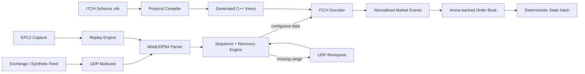

# Exchange Feed Engine

[](https://github.com/bhumi6633/exchange-feed-engine/actions/workflows/ci.yml)


**A C++20 market-data engine that reconstructs a deterministic limit order book from Nasdaq ITCH 5.0 traffic, recovers missing MoldUDP64 sequences, and generates specialized binary decoders from a custom protocol DSL.**

Built around one idea:

> **Move abstraction to build time. Keep the runtime path explicit, bounded, and measurable.**

This is not a trading bot, brokerage, or price-prediction system. It is the infrastructure layer underneath those systems: receive market events, decode them, recover missing data, reconstruct state, replay it deterministically, and measure the result.

---

## Why this exists

An exchange feed is not just:

```text
AAPL = $200.15
```

It is a continuously changing stream of events:

```text
ADD order #18473
EXECUTE 50 shares of #18473
CANCEL 20 shares of #92110
DELETE order #55712
REPLACE #73192 -> #73193
```

A consumer must reconstruct the market from those updates.

That creates several systems problems at once:

| Problem                   | Failure mode                                         | This project                             |
| ------------------------- | ---------------------------------------------------- | ---------------------------------------- |
| Binary wire formats       | Incorrect offsets or byte order corrupt values       | Schema-generated typed decoders          |
| UDP packet loss           | One missing event can permanently corrupt book state | Sequence tracking + gap recovery         |
| Out-of-order delivery     | Future events may depend on missing state            | Reorder buffering + contiguous release   |
| Per-order heap allocation | Allocator overhead and unpredictable latency         | Fixed-capacity order arena               |
| Handwritten parsers       | Repetitive, fragile protocol code                    | Custom DSL + C++ code generation         |
| Live-only failures        | Difficult to reproduce bugs                          | Capture + deterministic replay           |
| Performance folklore      | “Fast” without evidence                              | Repeatable benchmark + reference decoder |

The central invariant is simple:

> **The order book never observes an out-of-sequence market event.**

---

## Architecture



The live and replay paths converge before decoding so both exercise the same framing, sequencing, decoding, and book logic.

---

## What it implements

### Market-data pipeline

* Nasdaq TotalView-ITCH 5.0 message layouts
* MoldUDP64 packet framing
* multicast receive path
* sequence-number tracking
* gap detection
* future-message buffering
* duplicate/stale suppression
* retransmission request encoding
* contiguous ordered release

### Order-book reconstruction

Supports:

```text
A  Add Order
F  Add Order with MPID
E  Order Executed
C  Order Executed with Price
X  Order Cancel
D  Order Delete
U  Order Replace
```

The book maintains:

* unique live order IDs
* best bid / best ask
* price levels
* aggregate quantity
* FIFO priority within each level
* fixed-point prices
* deterministic state
* explicit invalid-transition handling

### Data-oriented storage

Orders are not individually allocated with `new`.

```text
Order ID
   |
   v
Flat open-addressed index
   |
   v
Arena slot
   |
   +--> price level
   |
   +--> previous / next FIFO slot
```

The storage model uses:

* fixed-capacity arena
* free-list slot reuse
* slot indices instead of per-order heap objects
* intrusive FIFO links
* open-addressed order-ID index
* ordered bid/ask price levels

---

## Protocol compiler

Binary protocol parsing is generated from a small declarative schema.

Example:

```text
message AddOrder "A" {
    stock_locate:      u16_be;
    tracking_number:   u16_be;
    timestamp:         u48_be;
    order_reference:   u64_be;
    side:              char;
    shares:            u32_be;
    stock:             ascii[8];
    price:             price4;
}
```

The build pipeline is:

```text
schema
  |
  v
lexer
  |
  v
parser
  |
  v
AST
  |
  v
semantic validation
  |
  v
C++ code generation
  |
  v
specialized typed views
```

Generated accessors handle:

* big-endian integers
* 48-bit timestamps
* fixed-width ASCII
* Price(4) / Price(8)
* exact message sizes
* message-type validation

The hot path does **not** interpret the schema at runtime.

---

## Why generate decoders?

The experiment behind the project is:

> **How much runtime performance can a schema-generated decoder retain compared with a simple handwritten implementation?**

Instead of putting generic protocol abstractions in the runtime path:

```text
runtime schema
     |
generic decoder
```

the abstraction happens before compilation:

```text
schema
  |
compiler
  |
specialized C++
  |
optimized binary
```

This keeps protocol definitions maintainable while still producing transparent, protocol-specific code.

---

## Gap recovery

UDP multicast is intentionally not treated as reliable transport.

Suppose the next expected message is `102`:

```text
received: 100 101 104 105
```

The engine does **not** process `104`.

Instead:

```text
applied
100 101

missing
102 103

buffered
104 105
```

A rerequest is issued for the missing range.

If `102` arrives first:

```text
102 applied
103 still missing
104 105 remain buffered
```

When `103` arrives:

```text
102 103 104 105
```

can be released contiguously.

Future traffic can continue arriving while recovery is in progress.

---

## Deterministic replay

Live packet streams can be written to the project's `EFC2` capture format.

```text
live traffic
    |
    +------> engine
    |
    +------> capture
```

The same capture can later be replayed through the normal pipeline.

Supported modes:

```bash
--speed max
--speed 4.0
--realtime
--step
```

Repeated processing of identical ordered input produces the same FIFO-aware state hash.

This makes failures reproducible and gives benchmarks an identical workload.

---

## Quick start

### Requirements

* CMake 3.20+
* C++20 compiler
* macOS or Linux
* Clang for libFuzzer targets

### Build

```bash
cmake -S . -B build -DCMAKE_BUILD_TYPE=Release
cmake --build build --parallel
```

### Test

```bash
ctest --test-dir build --output-on-failure
```

### Run the end-to-end demo

```bash
./build/feed_engine demo
```

The demo generates synthetic ITCH/MoldUDP64 traffic, introduces out-of-order delivery, exercises recovery, and reconstructs the final book.

---

## Replay a capture

Create one:

```bash
./build/feed_engine make-sample-capture sample.efc
```

Replay at maximum speed:

```bash
./build/feed_engine replay sample.efc --speed max
```

Replay with original pacing:

```bash
./build/feed_engine replay sample.efc --realtime
```

Step through packets manually:

```bash
./build/feed_engine replay sample.efc --step
```

---

## Live networking

```bash
./build/feed_engine listen \
    239.10.10.10 18000 \
    127.0.0.1 19000 \
    session.efc
```

This configures multicast ingestion, a unicast recovery endpoint, and optional capture output.

Real Nasdaq access requires external connectivity and market-data entitlements; this repository does not pretend otherwise.

---

## Correctness strategy

Performance optimization is only useful if state remains correct.

The project validates the engine from several independent directions.

### Differential decoding

Generated decoder output is checked against a deliberately simple handwritten reference implementation.

```text
GeneratedDecoder(bytes)
        ==
ReferenceDecoder(bytes)
```

### Model-based order-book testing

A deterministic randomized workload executes **100,000+ state transitions** against both:

```text
optimized book
      vs
simple reference model
```

and continuously compares invariants.

### Fault-injection pipeline tests

Large synthetic streams are:

* packetized
* reordered
* duplicated
* interrupted by sequence gaps
* recovered

The recovered path must produce the same final state as the canonical ordered path.

### Runtime hardening

Supported tooling includes:

* AddressSanitizer
* UndefinedBehaviorSanitizer
* libFuzzer
* malformed/truncated input tests
* deterministic state hashing

---

## Build with sanitizers

```bash
cmake -S . -B build-asan \
    -DCMAKE_BUILD_TYPE=Debug \
    -DEFE_ENABLE_SANITIZERS=ON

cmake --build build-asan --parallel
ctest --test-dir build-asan --output-on-failure
```

---

## Fuzz the wire parsers

```bash
cmake -S . -B build-fuzz \
    -DCMAKE_CXX_COMPILER=clang++ \
    -DEFE_ENABLE_FUZZING=ON

cmake --build build-fuzz --parallel
```

ITCH:

```bash
./build-fuzz/fuzz_itch \
    fuzz/corpus/itch \
    -max_total_time=30
```

MoldUDP64:

```bash
./build-fuzz/fuzz_moldudp \
    fuzz/corpus/moldudp \
    -max_total_time=30
```

---

## Benchmark

```bash
./build/efe_bench
```

The benchmark compares generated decoding with the independent handwritten reference path using the same deterministic workload.

The methodology includes:

* warmup
* repeated trials
* identical message streams
* alternating implementation order
* batched timing
* dead-code-elimination protection

Results are machine-specific engineering measurements, **not colocated-HFT latency claims**.

Full methodology is documented in [`docs/benchmarking.md`](docs/benchmarking.md).

---

## Project structure

```text
exchange-feed-engine/
│
├── schemas/
│   └── itch50.efe
│
├── tools/
│   └── protocolc/
│
├── include/efe/
│   ├── types.hpp
│   ├── events.hpp
│   ├── order_book.hpp
│   ├── recovery_engine.hpp
│   └── ...
│
├── src/
│   ├── itch_decoder.cpp
│   ├── moldudp64.cpp
│   ├── recovery_engine.cpp
│   ├── order_book.cpp
│   ├── capture.cpp
│   ├── replay.cpp
│   └── udp_receiver.cpp
│
├── tests/
├── fuzz/
├── bench/
├── examples/
├── docs/
│
├── CMakeLists.txt
└── FINAL_AUDIT.md
```

---

## Design principles

### Correctness before optimization

A fast corrupt book is useless.

Every optimization must preserve the same observable state as the reference path.

### Protocol details belong in one place

Wire offsets and field layouts live in the schema-generated path instead of being copied across the codebase.

### Keep the hot path explicit

Avoid unnecessary runtime polymorphism, generic schema interpretation, and per-order heap allocation.

### Make failure reproducible

Anything seen live should be replayable later.

### Measure before claiming

No optimization is considered an improvement without before/after evidence.

---

## Concepts demonstrated

This project intentionally crosses several areas of systems engineering:

### Market microstructure

* limit order books
* bids / asks
* spread
* market depth
* price-time priority
* executions
* cancellations
* replacements

### Data structures

* open-addressing hash tables
* free lists
* intrusive queues
* ordered price maps
* slot-based storage
* arena allocation

### Networking

* UDP
* multicast
* unicast
* packet framing
* packet loss
* sequence numbers
* retransmission

### Binary systems

* byte order
* fixed-width integers
* bounds-safe parsing
* fixed-point prices
* borrowed byte views

### Compiler construction

* DSL design
* lexer
* parser
* AST
* semantic analysis
* source generation

### Reliability

* out-of-order buffering
* gap recovery
* deduplication
* deterministic state reconstruction

### Performance engineering

* throughput
* tail latency
* cache locality
* allocation behavior
* benchmark bias
* profiling methodology

### Verification

* differential testing
* model-based testing
* randomized testing
* fault injection
* fuzzing
* sanitizers

---

## What this project intentionally does not claim

This is a systems research / portfolio project.

It is **not**:

* a trading strategy
* an exchange matching engine
* a broker
* a production market gateway
* a colocated trading stack
* an FPGA feed handler
* a kernel-bypass implementation
* a claim of production HFT latency

A production deployment would additionally involve concerns such as:

* commercial exchange connectivity
* entitlements
* NUMA / CPU affinity
* kernel bypass
* hardware timestamping
* observability
* redundancy
* failover
* long-running soak testing
* operational risk controls

Those are deliberately outside the scope of this repository.

---

## Documentation

* [`docs/ARCHITECTURE.md`](docs/ARCHITECTURE.md) — system architecture and invariants
* [`docs/protocol-compiler.md`](docs/protocol-compiler.md) — DSL, compiler, and generated views
* [`docs/recovery.md`](docs/recovery.md) — sequencing and recovery state machine
* [`docs/capture-format.md`](docs/capture-format.md) — EFC2 capture format
* [`docs/benchmarking.md`](docs/benchmarking.md) — benchmark methodology
* [`FINAL_AUDIT.md`](FINAL_AUDIT.md) — reproducibility and validation results

---

## References

* [Nasdaq TotalView-ITCH 5.0 Specification](https://www.nasdaqtrader.com/content/technicalsupport/specifications/dataproducts/NQTVITCHSpecification.pdf)
* [Nasdaq MoldUDP64 Specification](https://www.nasdaqtrader.com/content/technicalsupport/specifications/dataproducts/moldudp64.pdf)

---

## The question this project explores

> **How close can maintainable, schema-generated C++ market-data infrastructure get to a handwritten implementation while preserving deterministic correctness, recovery, and reproducibility?**

That question—not simply “building an order book”—is the reason this repository exists.
