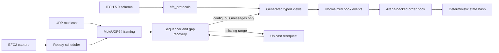

# Exchange Feed Engine

[](https://github.com/bhumi6633/exchange-feed-engine/actions/workflows/ci.yml)


A correctness-first C++20 research engine for decoding Nasdaq ITCH 5.0 market data, recovering packet gaps, maintaining a deterministic limit order book, and replaying captured sessions.

The central idea is simple: **move protocol knowledge to build time, then keep the runtime path explicit, bounded, and testable**. A small schema compiler turns declarative wire layouts into allocation-free typed views. Sequencing logic prevents incomplete streams from corrupting state. An arena-backed book avoids per-order heap allocation, while an independent decoder and model provide differential correctness oracles.

> This is not a trading strategy or a production exchange gateway. It is a systems-engineering project that makes the difficult parts of a real feed pipeline visible, measurable, and reproducible.

## Why this project exists

Exchange feeds look straightforward until correctness and performance must coexist.

A venue publishes compact binary messages over UDP. Packets may be duplicated, reordered, delayed, or lost. One malformed length can desynchronize a parser. One missing event can silently poison every later book update. A convenient object model can add allocations and unpredictable latency to the hottest path. Even a fast implementation is not useful if nobody can prove that it reconstructed the same state as the canonical ordered stream.

This project was inspired by that tension. It explores how a feed handler can preserve strong invariants without hiding the machinery behind a large framework:

- binary fields are declared once in a protocol schema;
- generated views read directly from caller-owned bytes;
- only contiguous sequence numbers may mutate the book;
- gap recovery is an explicit state machine, not an afterthought;
- prices remain fixed-point integers from wire to book;
- orders live in a preallocated arena rather than individual heap objects;
- replay, state hashes, reference implementations, and randomized tests make results reproducible.

The result is a compact laboratory for protocol engineering, data-oriented design, deterministic systems, and failure-aware networking.

## What makes it different

Many order-book demos begin after parsing and assume a perfect event stream. Exchange Feed Engine treats parsing, transport, sequencing, recovery, state mutation, and validation as one connected problem.

| Engineering problem | Approach in this repository |
|---|---|
| Wire formats are tedious and error-prone | A `.efe` DSL generates typed C++20 message views and validates schema constraints at build time. |
| UDP delivery is not reliable or ordered | MoldUDP64 packets are framed, sequenced, buffered, deduplicated, and released only as a contiguous stream. |
| Missing events invalidate downstream state | Gaps trigger explicit recovery requests; future packets wait until the missing range arrives. |
| Heap activity disturbs the hot path | Orders use a fixed-capacity arena, free list, intrusive FIFO links, and a flat open-addressed ID index. |
| Optimized parsers can be subtly wrong | Generated views are checked against an intentionally simple handwritten decoder. |
| Final state can hide ordering bugs | The book exposes a FIFO-aware deterministic state hash. |
| Benchmarks are easy to overstate | The harness warms up, alternates implementation order, runs multiple trials, and reports machine-specific results only. |

## End-to-end architecture



The live and replay paths converge before decoding. That gives both paths the same framing, sequence, normalization, and book behavior instead of maintaining two subtly different engines.

## Core invariants

These invariants define the project more than any individual optimization:

1. **Sequence safety:** only contiguous market events reach the order book.
2. **Numeric fidelity:** prices remain fixed-point integers in wire views and persistent book state.
3. **Bounded order storage:** no per-order `new` or `delete` occurs on the hot path.
4. **Single source of protocol truth:** production offsets live in the schema and generated views.
5. **Determinism:** identical ordered inputs produce an identical FIFO-aware state hash.
6. **Evidence before claims:** performance changes require correctness coverage and before/after measurement.

## Pipeline tour

### 1. Protocol schema compiler

[`tools/protocolc/main.cpp`](tools/protocolc/main.cpp) compiles [`schemas/itch50.efe`](schemas/itch50.efe) into C++ headers during the CMake build. The schema currently describes 23 ITCH 5.0 message layouts.

The compiler validates duplicate names, field bounds, overlaps, message sizes, and supported scalar types. Generated views expose checked construction plus big-endian fixed-width accessors without constructing a second materialized message object.

```text
message AddOrder "A" {
  stock_locate: u16_be;
  tracking_number: u16_be;
  timestamp: u48_be;
  order_reference: u64_be;
  side: char;
  shares: u32_be;
  stock: ascii[8];
  price: price4;
}
```

The corresponding generated API is used like this:

```cpp
using efe::generated::nasdaqitch50::AddOrderView;

const AddOrderView view{message_bytes}; // validates type and exact size
const std::uint64_t id = view.order_reference();
const std::uint32_t price = view.price(); // fixed-point, four decimals
```

No protocol offset table is duplicated in the production decoder. The only deliberate exception is the simple handwritten reference decoder used as an independent differential-test oracle.

### 2. ITCH decoding and normalization

[`src/itch_decoder.cpp`](src/itch_decoder.cpp) handles the order-affecting ITCH messages:

- `A` — Add Order
- `F` — Add Order with MPID Attribution
- `E` — Order Executed
- `C` — Order Executed with Price
- `X` — Order Cancel
- `D` — Order Delete
- `U` — Order Replace

Wire messages are normalized into a small event vocabulary before book mutation. This keeps protocol-specific parsing separate from state-management logic and makes synthetic testing straightforward.

### 3. MoldUDP64 framing and recovery

[`src/moldudp64.cpp`](src/moldudp64.cpp) parses session headers, packet sequence numbers, length-prefixed message blocks, heartbeats, and end-of-session markers.

[`src/recovery_engine.cpp`](src/recovery_engine.cpp) tracks the next expected sequence and enforces the critical ordering boundary:

```text
receive 100, 101, 104, 105
deliver 100, 101
detect gap [102, 103]
buffer 104, 105 and request the missing range
receive 102, 103
deliver 102, 103, 104, 105
```

Duplicate and stale packets are suppressed. Partial recovery advances the missing range, and buffered future packets are released only when the stream becomes contiguous.

### 4. Data-oriented order book

[`src/order_book.cpp`](src/order_book.cpp) stores orders in fixed-capacity slots. A free list recycles slots, a flat open-addressed hash table maps order IDs to slots, and intrusive links preserve FIFO priority within each price level.

The book supports add, execute, cancel, delete, and atomic replace behavior. Symbol values use fixed eight-byte storage; prices use integer `price4` representation. Capacity exhaustion and invalid transitions return explicit errors instead of allocating or silently repairing state.

The state hash includes price-level ordering and per-level FIFO order, so two books with the same aggregate quantities but different queue priority do not compare as equal.

### 5. Capture and deterministic replay

[`src/capture.cpp`](src/capture.cpp) writes portable EFC2 capture files with explicit byte order and bounded record lengths. [`src/replay.cpp`](src/replay.cpp) can replay them in four modes:

- maximum speed;
- original realtime pacing;
- scaled pacing;
- manual step mode.

This turns a transient network session into a repeatable debugging artifact. The same capture can reproduce a parser issue, validate a recovery change, or compare two implementations without needing a live feed.

### 6. Live networking

[`src/udp_receiver.cpp`](src/udp_receiver.cpp) provides the POSIX transport layer for multicast ingestion and unicast rerequests. The engine supports multicast group and port configuration, controlled shutdown, and session-aware recovery requests.

Network behavior is exercised in automated tests where the environment permits local socket binding; restricted containers may report the network test as skipped.

## Who this helps

This repository is useful to several audiences:

- **Systems programmers** can study byte order, bounds-safe binary views, cache-conscious storage, and explicit failure handling in one coherent codebase.
- **Market-data learners** can follow the path from MoldUDP64 datagram to normalized ITCH event to FIFO book state without requiring exchange connectivity.
- **Compiler and tooling engineers** can see a small DSL replace handwritten layout boilerplate while retaining transparent generated code.
- **Performance engineers** get a benchmark whose workload and limitations are documented, plus a reference implementation for correctness comparisons.
- **Maintainers and interviewers** can evaluate concrete evidence: deterministic hashes, model-based randomized tests, fault injection, sanitizers, fuzz targets, and CI rather than unsupported latency claims.

Its broader purpose is educational: demonstrate that high-performance systems work is not only about reducing nanoseconds. It is also about making state transitions auditable, failures reproducible, and assumptions executable as tests.

## Technology stack

| Area | Technology / concept |
|---|---|
| Language | C++20 |
| Build | CMake 3.20+, CTest |
| Protocol tooling | Custom `.efe` DSL and native schema compiler |
| Market protocols | Nasdaq TotalView-ITCH 5.0, MoldUDP64 |
| Data representation | `std::span`, big-endian scalar reads, fixed-point prices, fixed-size symbols |
| Book storage | Preallocated arena, free list, intrusive FIFO queues, open-addressed hash index |
| Reliability | Sequence state machine, future-packet buffering, deduplication, rerequest encoding |
| Reproducibility | Portable capture format, deterministic replay, stable state hashing |
| Verification | Unit, integration, model-based, differential, randomized, fault-injection, fuzz tests |
| Runtime diagnostics | AddressSanitizer and UndefinedBehaviorSanitizer |
| Automation | GitHub Actions across Debug, Release, sanitizers, and fuzz builds |

## Quick start

### Requirements

- CMake 3.20 or newer
- a C++20 compiler
- macOS or Linux for the POSIX network path
- Clang for libFuzzer targets

### Build and test

```bash
cmake -S . -B build -DCMAKE_BUILD_TYPE=Release
cmake --build build --parallel
ctest --test-dir build --output-on-failure
```

### Run the synthetic end-to-end demo

```bash
./build/feed_engine demo
```

The demo generates MoldUDP64 traffic containing ITCH messages, intentionally reorders delivery, exercises recovery, and prints the final deterministic book state.

### Run the benchmark

```bash
./build/efe_bench
```

The benchmark compares generated views with the handwritten reference decoder over a deterministic mixed `A/E/X/D/U` workload. Treat the output as a local engineering measurement—not a production latency claim.

## Command-line workflows

Listen to multicast traffic, send gap rerequests to a unicast endpoint, and optionally capture every datagram:

```bash
./build/feed_engine listen \
  239.10.10.10 18000 \
  127.0.0.1 19000 \
  session.efc
```

Replay a capture at maximum speed:

```bash
./build/feed_engine replay session.efc --speed max
```

Replay with original timing, at a scale factor, or one packet at a time:

```bash
./build/feed_engine replay session.efc --realtime
./build/feed_engine replay session.efc --speed 4.0
./build/feed_engine replay session.efc --step
```

Create a small deterministic capture without a live feed:

```bash
./build/feed_engine make-sample-capture sample.efc
./build/feed_engine replay sample.efc --speed max
```

Run `./build/feed_engine --help` for the complete command summary.

## Verification strategy

Correctness is checked at multiple boundaries rather than inferred from one happy-path test.

| Layer | Evidence |
|---|---|
| Schema compiler | All declared messages generate; malformed, overlapping, duplicate, and out-of-bounds schemas fail. |
| Decoder | Generated views agree with the independent reference decoder; malformed messages are rejected. |
| Order book | Hand-authored transitions plus 100,000 deterministic randomized operations are checked against a simpler model. |
| Recovery | Gap discovery, buffering, deduplication, partial fills, heartbeats, and contiguous release are tested. |
| Full pipeline | 50,000 deterministic events are packetized, shuffled, duplicated, recovered, and compared with the canonical ordered path. |
| Capture/replay | Round trips, malformed or truncated files, length limits, timing modes, and stop behavior are covered. |
| Runtime safety | AddressSanitizer and UndefinedBehaviorSanitizer test builds are part of the workflow. |
| Parser robustness | Separate ITCH and MoldUDP64 libFuzzer targets include committed seed corpora. |

Run the standard suite:

```bash
cmake -S . -B build-test \
  -DCMAKE_BUILD_TYPE=Debug \
  -DCMAKE_CXX_FLAGS='-Wall -Wextra -Wpedantic -Werror'
cmake --build build-test --parallel
ctest --test-dir build-test --output-on-failure
```

Run sanitizer builds:

```bash
cmake -S . -B build-asan \
  -DCMAKE_BUILD_TYPE=Debug \
  -DEFE_ENABLE_SANITIZERS=ON
cmake --build build-asan --parallel
ctest --test-dir build-asan --output-on-failure
```

Build and exercise fuzz targets with Clang:

```bash
cmake -S . -B build-fuzz \
  -DCMAKE_CXX_COMPILER=clang++ \
  -DEFE_ENABLE_FUZZING=ON
cmake --build build-fuzz --parallel

./build-fuzz/fuzz_itch fuzz/corpus/itch -max_total_time=30
./build-fuzz/fuzz_moldudp fuzz/corpus/moldudp -max_total_time=30
```

The exact CI jobs and commands are defined in [`.github/workflows/ci.yml`](.github/workflows/ci.yml).

## Measured evidence

The repository records reproducible local validation in [`FINAL_AUDIT.md`](FINAL_AUDIT.md). At the recorded audit point:

- the deterministic 100,000-operation book model test passed with seed `0xEFE5EED`;
- the 50,000-event recovery pipeline test delivered the contiguous range `1..50000` and matched the ordered-path hash;
- ASan and UBSan completed without reported findings;
- extended local fuzzing processed more than 1.4 million ITCH inputs and 237,000 MoldUDP64 inputs without a crash;
- the generated and reference decoders produced the same final state hash, `b6cac6573c4522b7`.

One recorded Apple Silicon/AppleClang run measured the generated-view path at 129.74 million messages per second and the simpler reference path at 274.15 million messages per second on the synthetic benchmark workload. That result is intentionally reported as evidence, including the fact that the generated path is currently slower—not as a universal or production/HFT number. Compiler, hardware, thermals, workload shape, and benchmark design all matter.

## Repository map

```text
.
├── schemas/              Protocol source of truth (`itch50.efe`)
├── tools/                Schema compiler
├── include/efe/          Public engine interfaces
├── src/                  Decoder, recovery, book, network, capture, replay
├── tests/                Unit, integration, model, pipeline, and fuzz tests
├── bench/                Deterministic decoder/book benchmark
├── examples/             Synthetic end-to-end demo
├── .github/workflows/    CI definitions
├── docs/                 Architecture, protocol, recovery, and format notes
└── FINAL_AUDIT.md        Commands, results, and engineering assessment
```

## Concepts demonstrated

The codebase is intentionally small enough to read but deep enough to demonstrate:

- network byte order and bounds-safe binary parsing;
- code generation as a correctness and maintainability tool;
- zero-materialization views over borrowed byte spans;
- sequence-number arithmetic and loss recovery;
- idempotence under duplicated delivery;
- data-oriented storage and stable slot identities;
- intrusive queues and price-time priority;
- deterministic state hashing;
- model-based and differential testing;
- property-oriented fault injection;
- portable binary file design;
- replay clocks and injectable time;
- benchmark bias, warmup, batching, and measurement caveats.

## Intentional boundaries

Keeping scope explicit makes the engineering claims meaningful:

- this is a research and portfolio engine, not certified production trading infrastructure;
- it reconstructs order-book state but does not implement strategies, order entry, risk controls, or execution;
- it does not claim exchange-colocated or production HFT latency;
- generated views are allocation-free, but the current book still uses ordered maps for price levels;
- only the implemented order-affecting ITCH messages mutate the book, although the schema covers additional layouts;
- real exchange connectivity, entitlement, operational monitoring, failover, and long-running soak validation remain deployment concerns outside this repository.

These boundaries also suggest meaningful extensions: denser price-level structures, richer observability, persistent recovery sessions, packet-capture import, cross-platform transports, and workload-specific profiling. Any optimization should retain the existing correctness oracle and include before/after benchmark evidence.

## Design documentation

- [`docs/ARCHITECTURE.md`](docs/ARCHITECTURE.md) — component boundaries, data flow, invariants, and failure behavior
- [`docs/protocol-compiler.md`](docs/protocol-compiler.md) — schema grammar, validation rules, and generated-view semantics
- [`docs/recovery.md`](docs/recovery.md) — recovery state machine and ordering guarantees
- [`docs/capture-format.md`](docs/capture-format.md) — EFC2 header, record layout, and timing rules
- [`docs/benchmarking.md`](docs/benchmarking.md) — workload, methodology, and interpretation
- [`FINAL_AUDIT.md`](FINAL_AUDIT.md) — validation commands, recorded results, limitations, and verdict

## Protocol references

Wire-layout decisions should be checked against the official specifications:

- [Nasdaq TotalView-ITCH 5.0 specification](https://www.nasdaqtrader.com/content/technicalsupport/specifications/dataproducts/NQTVITCHSpecification.pdf)
- [Nasdaq MoldUDP64 specification](https://www.nasdaqtrader.com/content/technicalsupport/specifications/dataproducts/moldudp64.pdf)

## Contributing

Changes are welcome when they preserve the engine's core invariants. Before opening a change:

1. add or update a correctness test;
2. run the standard and sanitizer suites;
3. add before/after benchmark evidence for performance work;
4. keep protocol offsets in the schema-generated path;
5. document any new assumption or non-obvious failure mode.

The best contributions make the system easier to reason about as well as faster.
