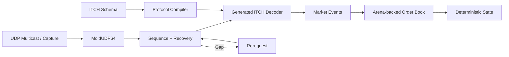

# MarketWire - Nasdaq Market Data Engine

[](https://github.com/bhumi6633/exchange-feed-engine/actions/workflows/ci.yml)


**A C++20 market-data engine for decoding Nasdaq ITCH 5.0, recovering MoldUDP64 sequence gaps, reconstructing a deterministic limit order book, and generating binary decoders from a custom protocol DSL.**

> **The idea:** do the protocol-heavy work during the build, then keep runtime decoding small, predictable, and easy to measure.

---

## Why I built it

Exchange feeds are ordered streams of binary events, not simple price snapshots.

```text
ADD #18473
EXECUTE #18473 50
CANCEL #92110 20
DELETE #55712
REPLACE #73192 → #73193
```

A consumer must reconstruct the current market from these updates. Missing even one event can corrupt every state transition that follows.

I built this project to dig into the systems work behind that process: binary protocols, unreliable delivery, order-book reconstruction, memory layout, code generation, replay, and honest performance measurement.

---

## Architecture



The order book only receives **contiguous, correctly ordered events**.

---

## Highlights

* **Nasdaq ITCH 5.0 decoding** for order-affecting `A/F/E/C/X/D/U` messages
* **MoldUDP64 framing** with sequence tracking, gap detection, buffering, and rerequests
* **Custom protocol compiler**: lexer → parser → AST → semantic validation → C++ generation
* **Arena-backed limit order book** with price-time priority and FIFO ordering
* **Open-addressed order-ID index** for fast order lookup
* **Fixed-point prices** and bounds-safe big-endian binary decoding
* **Deterministic capture + replay** with max-speed, scaled, realtime, and step modes
* **Differential, randomized, sanitizer, fuzz, and CI validation**

---

## Protocol Compiler

Wire layouts are declared once:

```text
message AddOrder "A" {
    stock_locate:    u16_be;
    tracking_number: u16_be;
    timestamp:       u48_be;
    order_reference: u64_be;
    side:            char;
    shares:          u32_be;
    stock:           ascii[8];
    price:           price4;
}
```

The build generates specialized typed C++ views:

```text
Schema
  ↓
Lexer
  ↓
Parser
  ↓
AST
  ↓
Semantic Validation
  ↓
C++ Code Generation
```

The schema is interpreted at **build time**, so the runtime decoder does not need a generic protocol interpreter.

---

## Gap Recovery

Suppose the engine expects sequence `102`:

```text
received: 100 101 104 105
```

It does not process `104` immediately.

```text
applied:   100 101
missing:   102 103
buffered:  104 105
```

The engine requests the missing range and keeps buffering newer traffic. Once `102` and `103` arrive, it can release:

```text
102 103 104 105
```

in order.

This prevents packet loss from silently corrupting downstream book state.

---

## Order Book

The book maintains:

* best bid / best ask
* ordered price levels
* aggregate quantities
* FIFO order within each price level
* unique live order IDs
* deterministic state hashing

Orders use preallocated arena slots instead of individual heap allocations:

```text
Order ID
   ↓
Open-addressed index
   ↓
Arena slot
   ↓
Price level + FIFO links
```

---

## Build

```bash
cmake -S . -B build -DCMAKE_BUILD_TYPE=Release
cmake --build build --parallel
ctest --test-dir build --output-on-failure
```

Run the synthetic end-to-end demo:

```bash
./build/feed_engine demo
```

Create and replay a capture:

```bash
./build/feed_engine make-sample-capture sample.efc
./build/feed_engine replay sample.efc --speed max
```

Benchmark generated vs. reference decoding:

```bash
./build/efe_bench
```

---

## Verification

The engine is validated using:

* generated-vs-handwritten decoder differential tests
* deterministic randomized order-book testing
* fault-injected sequence/recovery tests
* AddressSanitizer + UndefinedBehaviorSanitizer
* libFuzzer targets for ITCH and MoldUDP64
* deterministic replay/state hashes
* GitHub Actions CI

Detailed results and methodology are documented in [`FINAL_AUDIT.md`](FINAL_AUDIT.md).

---

## Repository

```text
schemas/          Protocol definitions
tools/protocolc/  DSL compiler
include/efe/      Public interfaces
src/              Engine implementation
tests/            Correctness + integration tests
fuzz/             Parser fuzz targets
bench/            Benchmarks
docs/             Architecture deep dives
```

---

## Deep Dives

* [`docs/ARCHITECTURE.md`](docs/ARCHITECTURE.md)
* [`docs/protocol-compiler.md`](docs/protocol-compiler.md)
* [`docs/recovery.md`](docs/recovery.md)
* [`docs/capture-format.md`](docs/capture-format.md)
* [`docs/benchmarking.md`](docs/benchmarking.md)

---

## Official Protocol References

The wire layouts and transport behavior are based on Nasdaq's official specifications:

* [Nasdaq TotalView-ITCH 5.0 Specification](https://www.nasdaqtrader.com/content/technicalsupport/specifications/dataproducts/NQTVITCHSpecification.pdf)
* [Nasdaq MoldUDP64 Specification](https://www.nasdaqtrader.com/content/technicalsupport/specifications/dataproducts/moldudp64.pdf)

The Nasdaq specifications are the source of truth. This project implements the subset needed to study order-book reconstruction.

---

## Scope

This is a **systems research / portfolio project**, not a trading strategy or production HFT gateway.

It does not connect to Nasdaq or claim colocation, kernel bypass, FPGA acceleration, or production trading latency.

---

> **What I wanted to find out:** Can generated C++ protocol code stay maintainable and still compete with handwritten decoding without giving up correctness, recovery, or reproducibility?
