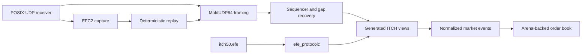

# Architecture

Each part of the pipeline has one clear job. Framing never reads past the end of a datagram. Recovery releases only contiguous sequences. Decoding turns validated wire messages into fixed-width events. The book manages order IDs, quantities, levels, and FIFO priority. Capture happens at the datagram boundary, so replay follows the same path as live traffic.

Prices stay as unsigned fixed-point integers. Orders live in a fixed-capacity slot arena with intrusive FIFO links and a preallocated, open-addressed ID index. Price levels use ordered maps because they keep the implementation easy to inspect and verify.

The networking code is a POSIX implementation suitable for synthetic and authorized inputs. It is not an exchange entitlement, production operations stack, or kernel-bypass implementation.

## Component boundaries

| Component | Input | Output | What it guarantees |
|---|---|---|---|
| UDP receiver | Multicast datagrams | Owned byte buffers | Shutdown wakes a blocked receiver |
| MoldUDP64 parser | One datagram | Session, sequence, message spans | No read crosses the datagram boundary |
| Recovery engine | Framed sequenced messages | Contiguous messages | No gap or duplicate reaches downstream state |
| ITCH decoder | Validated message bytes | Normalized book events | Protocol details do not leak into the book |
| Order book | Normalized events | Queryable deterministic state | IDs, quantities, levels, and FIFO links remain consistent |
| Capture/replay | Timestamped datagrams | Original datagram sequence | Replay enters through the same parser as live input |

## Hot-path data flow

Generated views validate message type and exact encoded size, then read fixed offsets through bounds-checked big-endian helpers. Order-affecting messages become fixed-width domain events. The book applies those events to preallocated slots and a preallocated ID index; it does not allocate one object per order.

Ordered maps make best-price lookup and price ordering straightforward to audit. Order identity and FIFO membership use the more data-oriented parts of the design. If the level container changes, the new version needs the same correctness coverage plus before-and-after benchmark results.

## What happens when input is bad

Malformed framing stops at the transport boundary. Unknown or malformed ITCH messages do not mutate the book. Future sequences remain buffered until their missing prefix is restored. Invalid book transitions return failure rather than inventing state. Capacity exhaustion is explicit because the arena is bounded.

## Determinism and threading

The state hash covers symbols, sides, price levels, quantities, and FIFO order. Ordered live input and recovered input must converge to the same hash.

The engine currently uses one serialized processing pipeline. A wake pipe lets it shut down a blocked POSIX receiver cleanly. Book mutation is not lock-free or multi-threaded. Adding parallelism would first require clear rules for ownership and event ordering.
