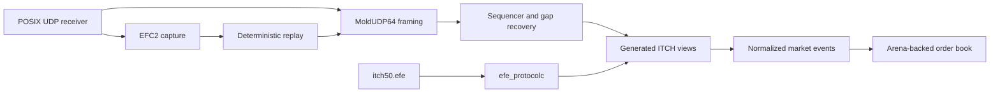

# Architecture

Each layer owns one invariant. Framing never reads beyond a datagram. Recovery releases only a contiguous sequence. Decoding converts validated wire layouts into fixed-width domain events. The book owns order identity, quantities, levels, and FIFO priority. Capture operates at the datagram boundary so replay traverses the same production-neutral pipeline.

Persistent prices are unsigned fixed-point integers. Orders live in a fixed-capacity slot arena with intrusive FIFO links and a preallocated open-addressed ID index. Ordered maps remain a deliberate research tradeoff for price levels.

The networking code is a POSIX implementation suitable for synthetic and authorized inputs. It is not an exchange entitlement, production operations stack, or kernel-bypass implementation.
